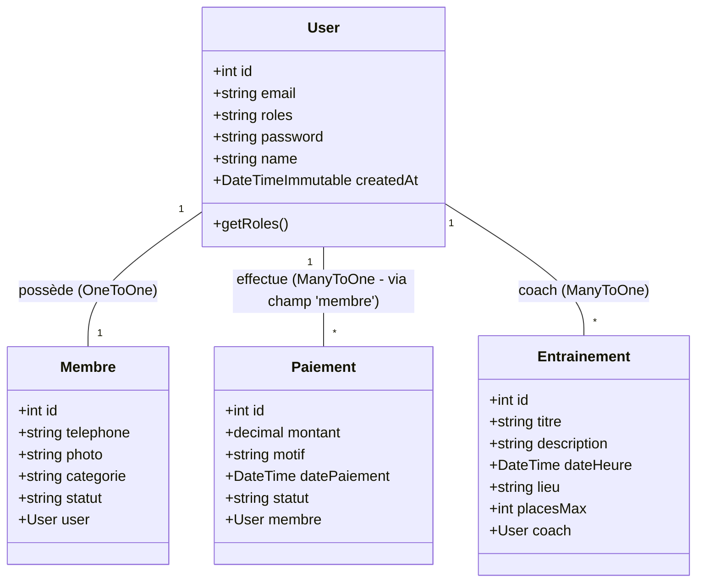

# Rapport Technique Détaillé - Projet Gestion Club Sportif (G.C.S)

**Date :** 09 Janvier 2026
**Projet :** Système de Gestion de Club Sportif (G.C.S)
**Version du Document :** 1.0

---

## 1. Introduction
Ce document présente une analyse technique détaillée de l'application web "G.C.S", développée avec le framework Symfony. L'application a pour but de gérer les opérations quotidiennes d'un club sportif, incluant la gestion des membres, des paiements, des entraînements et des rôles utilisateurs (Administrateurs et Membres).

Le rapport couvre l'architecture logicielle, le diagramme de classes (UML), ainsi que la cartographie précise entre les Contrôleurs (logique métier) et les Vues (interface utilisateur).

---

## 2. Architecture Globale
L'application suit le pattern architectural **MVC** (Modèle-Vue-Contrôleur) imposé par Symfony :
- **Modèle (Entities)** : Représentation des données via Doctrine ORM.
- **Vue (Templates)** : Interface utilisateur rendue via le moteur Twig.
- **Contrôleur (Controllers)** : Orchestration de la logique et des réponses HTTP.

---

## 3. Diagramme de Classes (UML)

L'architecture des données repose sur quatre entités principales connectées entre elles.

**Relations Clés :**
- Un **User** est la base de l'authentification.
- Un **Membre** est une extension du profil utilisateur contenant les infos spécifiques au club (téléphone, photo, catégorie), lié en *OneToOne* à `User`.
- Un **Paiement** est lié à un `User` (le membre qui paye).
- Un **Entrainement** peut être assigné à un coach (`User`).

---

## 4. Analyse Détaillée : Contrôleurs et Routes

Cette section détaille chaque contrôleur, ses méthodes, les routes associées, et les fichiers de template (vues) rendus.

### 4.1. AdminController
**Responsabilité :** Gestion du Back-Office (Membres, Paiements, Entraînements).  
**Sécurité :** Accessible uniquement aux utilisateurs ayant le rôle `ROLE_ADMIN`.

| Méthode | Route URL | Nom de la Route | Template (Vue) | Description |
| :--- | :--- | :--- | :--- | :--- |
| `index()` | `/admin` | `app_admin_index` | `admin/index.html.twig` | Tableau de bord principal de l'administrateur. |
| `members()` | `/admin/members` | `app_admin_members` | `admin/members.html.twig` | Liste tous les membres. Vérifie et crée automatiquement des profils membres manquants. |
| `addMember()` | `/admin/members/add` | `app_admin_member_add` | `admin/add_member.html.twig` | Formulaire de création d'un utilisateur et de son profil membre associé. |
| `editMember()` | `/admin/members/edit/{id}` | `app_admin_member_edit` | `admin/edit_member.html.twig` | Édition d'un profil membre existant. |
| `deleteMember()` | `/admin/members/delete/{id}` | `app_admin_member_delete` | *Redirection* | Supprime un membre (Méthode POST uniquement). |
| `payments()` | `/admin/payments` | `app_admin_payments` | `admin/payments.html.twig` | Liste l'historique de tous les paiements. |
| `addPayment()` | `/admin/payments/add` | `app_admin_payment_add` | `admin/add_payment.html.twig` | Enregistrement manuel d'un paiement. |
| `editPayment()` | `/admin/payments/edit/{id}` | `app_admin_payment_edit` | `admin/edit_payment.html.twig` | Modification d'un paiement. |
| `deletePayment()` | `/admin/payments/delete/{id}` | `app_admin_payment_delete` | *Redirection* | Suppression d'un paiement. |
| `receiptPayment()`| `/admin/payments/receipt/{id}` | `app_admin_payment_receipt`| `admin/receipt.html.twig` | Génération/Affichage d'un reçu de paiement. |
| `trainings()` | `/admin/trainings` | `app_admin_trainings` | `admin/trainings.html.twig` | Liste des séances d'entraînement planifiées. |
| `addTraining()` | `/admin/trainings/add` | `app_admin_training_add` | `admin/add_training.html.twig` | Planification d'une nouvelle séance. |
| `editTraining()` | `/admin/trainings/edit/{id}` | `app_admin_training_edit` | `admin/edit_training.html.twig` | Modification d'une séance. |
| `deleteTraining()`| `/admin/trainings/delete/{id}` | `app_admin_training_delete` | *Redirection* | Annulation d'une séance. |

---

### 4.2. DashboardController
**Responsabilité :** Espace personnel du membre.  
**Sécurité :** Accessible uniquement aux utilisateurs ayant le rôle `ROLE_USER`.

| Méthode | Route URL | Nom de la Route | Template (Vue) | Description |
| :--- | :--- | :--- | :--- | :--- |
| `memberDashboard()` | `/dashboard` | `app_member_dashboard` | `dashboard/member.html.twig` | Affiche les 5 prochains entraînements et l'historique personnel des paiements du membre connecté. |

---

### 4.3. RegistrationController
**Responsabilité :** Gestion de l'inscription des nouveaux utilisateurs.

| Méthode | Route URL | Nom de la Route | Template (Vue) | Description |
| :--- | :--- | :--- | :--- | :--- |
| `register()` | `/register` | `app_register` | `registration/register.html.twig` | Traite le formulaire d'inscription. Crée un `User` et un `Membre` (statut 'actif'). Redirige vers le login après succès. |

---

### 4.4. SecurityController
**Responsabilité :** Gestion de l'authentification (Connexion / Déconnexion).

| Méthode | Route URL | Nom de la Route | Template (Vue) | Description |
| :--- | :--- | :--- | :--- | :--- |
| `login()` | `/login` | `app_login` | `security/login.html.twig` | Affiche le formulaire de connexion. Gère les erreurs d'authentification. |
| `logout()` | `/logout` | `app_logout` | *Intercepté par le Firewall* | Point de sortie pour déconnecter l'utilisateur. |

---

### 4.5. HomeController & PageController
**Responsabilité :** Pages publiques et statiques.

| Méthode | Route URL | Nom de la Route | Template (Vue) | Description |
| :--- | :--- | :--- | :--- | :--- |
| `HomeController::index()` | `/` | `app_home` | `dashboard/index.html.twig` | Page d'accueil publique (Landing page). |
| `PageController::about()` | `/about` | `app_about` | `pages/about.html.twig` | Page "À propos". |

---

## 5. Flux de Données (Exemple : Inscription)

Pour illustrer les interactions entre les composants, voici le flux logique lors d'une inscription :

1.  **Requête** : L'utilisateur visite `/register`.
2.  **Contrôleur** : `RegistrationController::register()` instancie `RegistrationFormType`.
3.  **Vue** : `register.html.twig` affiche le formulaire.
4.  **Soumission** : L'utilisateur envoie les données (POST).
5.  **Traitement** : 
    - Le contrôleur valide le formulaire.
    - Le mot de passe est haché via `UserPasswordHasherInterface`.
    - L'entité `User` est créée.
    - L'entité `Membre` est automatiquement instanciée et liée à l'utilisateur.
    - `EntityManager` persiste les deux entités en base de données.
6.  **Réponse** : Redirection vers la route `app_login`.

## 6. Conclusion
L'application G.C.S dispose d'une structure solide et modulaire grâce à Symfony. La séparation claire entre l'administration (`AdminController`) et l'espace membre (`DashboardController`) garantit une sécurité et une maintenabilité optimales. Les entités sont correctement normalisées pour gérer efficacement la relation entre les comptes utilisateurs techniques et les profils métiers (Membres).
